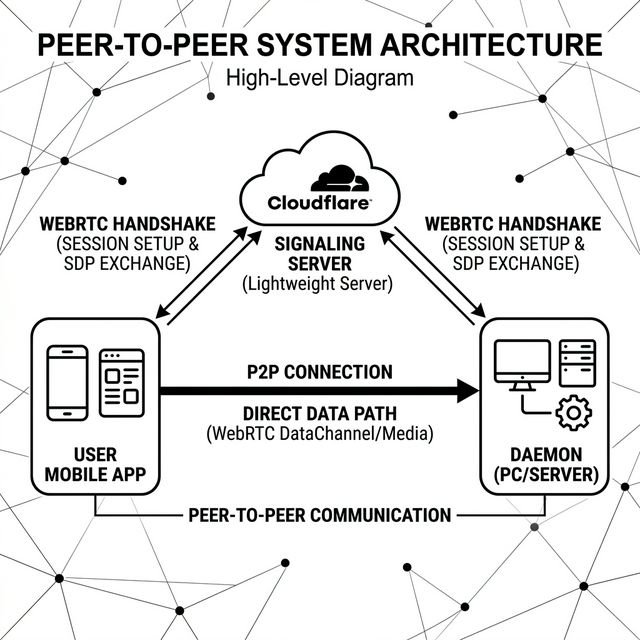

# OpenNodeRelay

[](https://github.com/usama3627/OpenNodeRelay/actions/workflows/ci.yml)

Welcome to **OpenNodeRelay** (formerly BYOC). This project is all about connecting your phone directly to your PC, allowing you to run shell commands, view live logs, and manage processes from absolutely anywhere—without having to expose your PC to the internet or worry about complex VPNs.



## Features

- **Direct P2P Connection:** Uses WebRTC to establish a secure, fast, and direct connection between your phone and PC—no middleman server handling your data.
- **Remote Terminal:** Run commands on your PC directly from your phone with a fully featured, live-rendering terminal UI.
- **Process Management:** View and manage running processes seamlessly from anywhere.
- **No Network Configuration Required:** Easily connect without needing to expose your PC, or set up port forwarding, or deal with complex VPNs.

## How It Works

It's actually pretty simple. It uses WebRTC, the exact same tech that runs video calls, but instead of streaming video, we use it to stream raw data directly between your devices.

1. **The Daemon:** You run the lightweight (Rust) daemon on your PC. It hangs out waiting for connections.
2. **The App:** You open the React Native app on your phone.
3. **The Handshake (Signaling):** Both the app and the daemon briefly talk to a Cloudflare Worker (our Signaling Server) for just 3-5 seconds. They exchange WebRTC SDP answers and ICE candidates.
4. **P2P Magic:** Once they know how to reach each other, the signaling server is completely dropped. Your app and daemon now talk directly P2P. No middleman. No weird routing. Just a fast, secure, direct pipe.

## Cloudflare Signaling Server

To make the magic handshake work without you having to punch holes in your router, we use a Cloudflare Worker and KV store as the signaling server.

Don't worry, we host the default one at `https://opennoderelay-signal.opennoderelay.workers.dev` and it's built right in, so you can just plug and play!

If you're deploying it yourself or want to see the limits (spoiler: Cloudflare's free tier handles ~160 pairings/day smoothly), check out our deployment guide here: [docs/DEPLOY_SIGNALING.md](docs/DEPLOY_SIGNALING.md).

## Building It Yourself

Releases for all platforms are available in the [Releases](https://github.com/usamaz/OpenNodeRelay/releases) tab. But if you want to compile it yourself:

### 1. The Daemon (Rust)
```bash
cd daemon
cargo build --release
```
The executable will be located at `target/release/opennoderelay-daemon`. We build this for macOS, Windows, and Linux!

### 2. The Mobile App (React Native)
While the app will ideally live on the App Store and Google Play Store soon, here's how you can compile the APK yourself:

**For Android APK:**
```bash
cd mobile/android
./gradlew assembleRelease
```
Your compiled APK will be at `mobile/android/app/build/outputs/apk/release/app-release.apk`.

**For iOS:**
*Note: The iOS application is intended to be downloaded directly from the App Store. However, if you are a developer with Xcode and an active Apple Developer account:*
```bash
cd mobile/ios
npx pod-install
```
Then open `OpenNodeRelay.xcworkspace` in Xcode, configure your signing profiles, and build to your device.

## Future Features

- **Daemon GUI & Auto-Start:** Adding a simple graphical user interface to the daemon and enabling it to automatically start on OS boot.
- **Persistent Connections:** Once a user authenticates the code, the connection details (like IP addresses) are remembered in settings. This allows users to easily reconnect their PC and mobile device directly in the future without needing the Cloudflare signaling server again, regardless of the network.
- **Live System Dashboard:** A clean UI in the mobile app to monitor real-time CPU, RAM, Disk usage, and temperatures of your PC.


## Feedback and Contributions

See [CONTRIBUTING.md](CONTRIBUTING.md) if you want to help out. It's a casual, community-driven project, so all issues and PRs are extremely welcome. Let's make this awesome!
